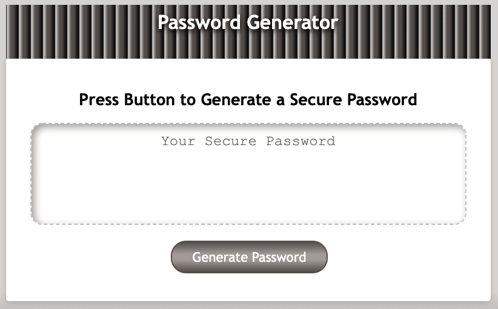
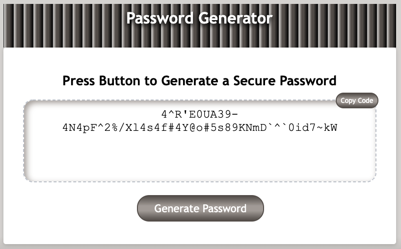

# BC03-02-Password-Generator

## Description

Javascript password generator
- To create randomised passwords with control over the specifics
- This tool can help with sites that have very specific requirements
- This project taught Javascript issues and extended my 

## Table of Contents (Optional)

If your README is long, add a table of contents to make it easy for users to find what they need.

- [Installation](#installation)
- [Usage](#usage)
- [Credits](#credits)
- [License](#license)
- [Features](#features)

## Installation

Access to website at https://rschragger.github.io/BC03-02-Password-Generator/ is all that is required

## Usage

### Initial view

Simply press the Generate Password button and follow the prompts

### After password generation

The password will appear in the central box
A "Copy Code" button will appear. Press this button to copy the password to your clipboard.

## Credits

[Google](google.com) and many Javascript references in [w3schools](https://www.w3schools.com) and [MDN(Mozilla Dev Network)](https://developer.mozilla.org/en-US/) were used frequently to research topics and syntax used.

Password special characters have been obtained from (https://owasp.org/www-community/password-special-characters)

## License

© Copyright Reeve Schragger 2022

## Features
- This returns the password into the interface
- There is a "Copy Code" button to ensure that the seletion of password characters is complete and fast
